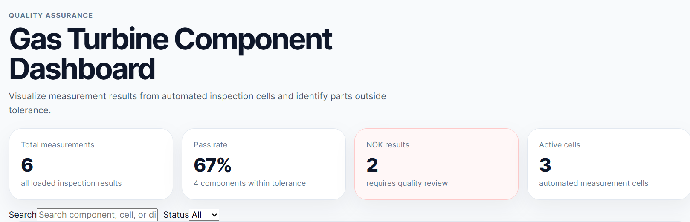
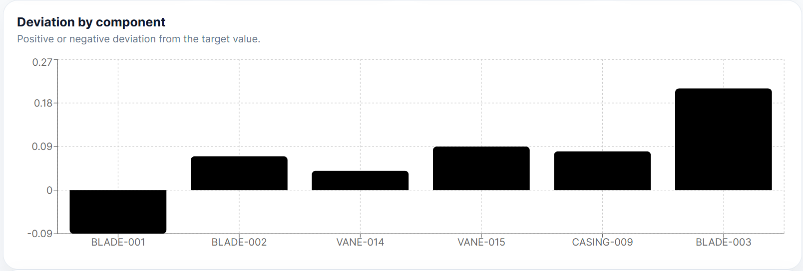
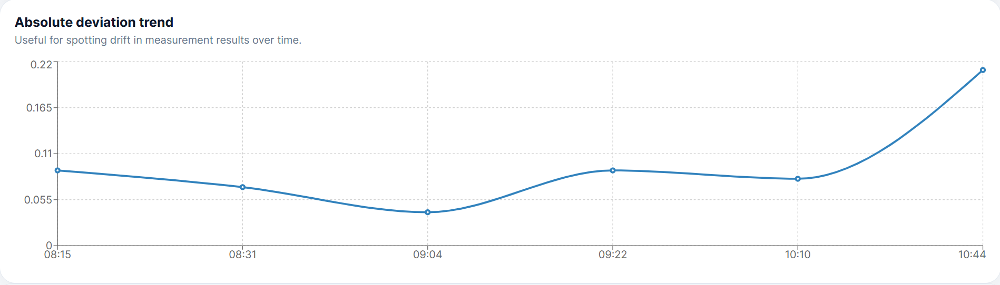
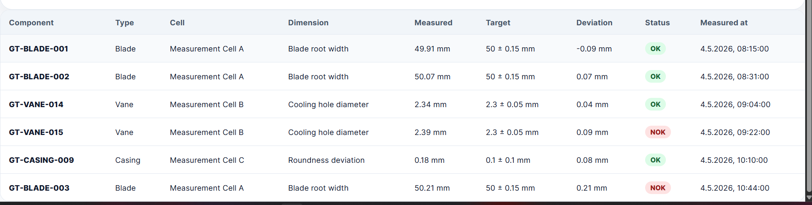

# my-first-react-app
A simple React + TypeScript frontend project for visualizing quality inspection 
data of gas turbine components.

## Project Idea

The app simulates a small quality assurance dashboard for gas turbine components.

It shows measurement results from automated measuring cells and helps users quickly understand whether a component is within tolerance or needs further review.

Each measurement contains:

- component ID
- measurement cell
- measured dimension
- measured value
- target value
- tolerance
- unit
- timestamp
- calculated OK/NOK status

## Features

- Dashboard overview with key quality metrics
- Measurement table
- Search by component, measurement cell, or dimension
- Filter by status: all, OK, or NOK
- Deviation chart by component
- Measurement trend chart
- Mock API layer for simulated backend data
- Clean feature-based React project structure
- TypeScript types for measurement data
- Utility functions for domain logic such as deviation and tolerance checks

## Getting Started
1. Install dependencies inside the project directory (/my-react-app):
   ```bash
   npm install
   ```
2. Start the development server:
   ```bash
   npm run dev
   ```
3. Open http://localhost:5173 in your browser to view the app.

## Demo
KPIs and metrics overview:


Trend chart showing measurement deviations over time:

Measurement table:



## Possible Backend Extension

The current version uses mock data. In a real application, you would implement a backend API to serve measurement data from a database.

A future backend could provide REST endpoints such as:
```
GET /api/measurements
GET /api/measurements/:id
POST /api/measurements
GET /api/components/:componentId/measurements
```

## Tech Stack

- React
- TypeScript
- Vite
- Recharts
- CSS
- Mock API data
